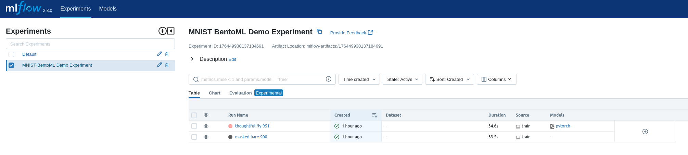
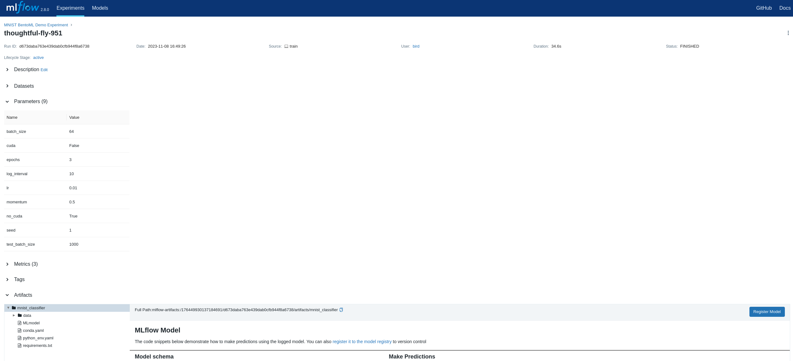
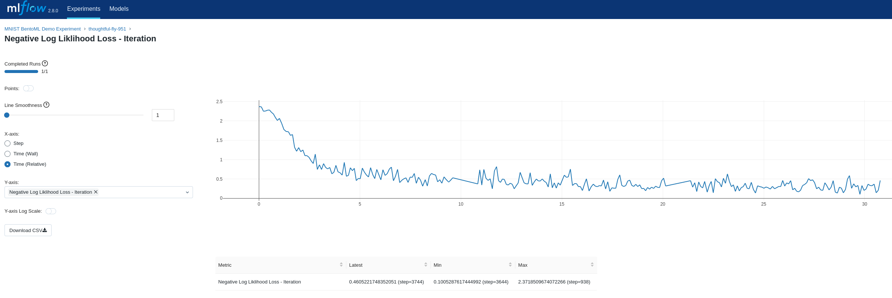
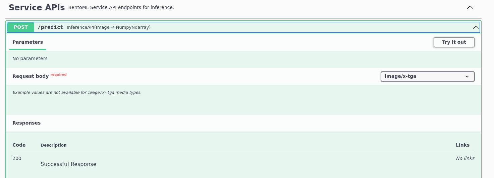
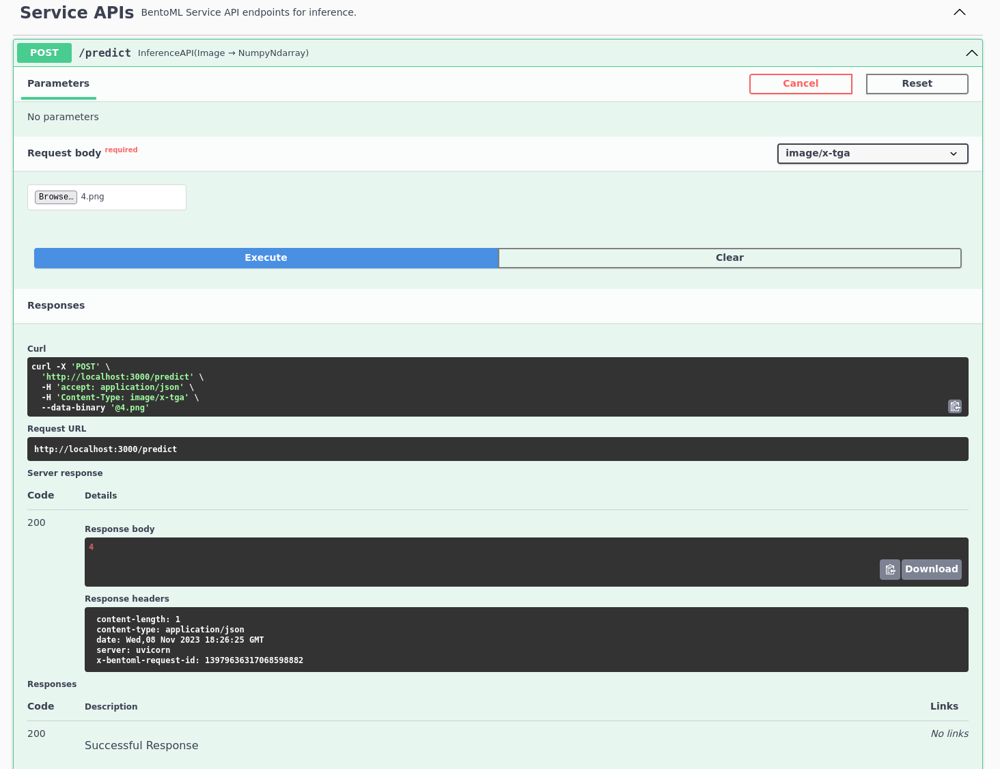

==================================
BentoML and MLFlow Integration Demo
==================================

A project to run a full end to end ML system, using MLFlow for tracking, and BentoML for packaging and serving. 🍣 For
this project I just used a simple MNIST network (as the results aren't important) as this project was for
demonstrating an integration between BentoML and MLFlow and how they could be used together.

It was interesting to use BentoML, especially for the model containerization, and I'd like to explore how to use it more
in a production setting. I liked the fact that you can package all the dependencies into a docker image with an easy
entrypoint automatically. 🐋

Features ⭐
--------

* Trains a model on the MNIST dataset to classify images of handwritten digits.
* Uses MLFlow as a backend tracking server to log metrics, parameters and models for development.
* Deploys a containerized bento of the trained model to serve predictions.

Installation 🖥️
------------

System dependencies
###########

- Python 3.10 or higher
- Docker
- BentoML
- Virtual environment
- Poetry

------------

Install the project in development mode with :code:`make install`

Running the project
--------

Follow the steps below in each section to run a model training and validation using MLFlow for tracking, and then package
and containerize the model using BentoML for easy deployment.

MLFLow tracking server 👁️
###########

- First, in a seperate terminal, run :code:`make run_mlflow_server` to spin up a locally served MLFLow server. The terminal output should look something like:

.. code-block:: bash

    $ make run_mlflow_server
    poetry run mlflow server --host 127.0.0.1 --port 8080
    [2023-11-08 16:13:20 +0000] [149201] [INFO] Starting gunicorn 21.2.0
    [2023-11-08 16:13:20 +0000] [149201] [INFO] Listening at: http://127.0.0.1:8080 (149201)
    [2023-11-08 16:13:20 +0000] [149201] [INFO] Using worker: sync
    [2023-11-08 16:13:20 +0000] [149208] [INFO] Booting worker with pid: 149208
    [2023-11-08 16:13:20 +0000] [149225] [INFO] Booting worker with pid: 149225
    [2023-11-08 16:13:20 +0000] [149226] [INFO] Booting worker with pid: 149226
    [2023-11-08 16:13:20 +0000] [149242] [INFO] Booting worker with pid: 149242
    [2023-11-08 17:17:49 +0000] [149201] [INFO] Handling signal: winch

- In your browser, open http://localhost:8080 and you should see the MLFlow tracking server running.

Running training 🏋️️
###########

- Run a training session with :code:`make train`. In the terminal, you should see:

.. code-block:: bash

    $ make train
    poetry run train
    08-Nov-23 17:52:50 - Create train and test loaders...
    08-Nov-23 17:52:50 - Training model
    /home/bird/Documents/src/bentoml_mlflow_demo/bentoml_mlflow_demo/mnist.py:38: UserWarning: Implicit dimension choice for log_softmax has been deprecated. Change the call to include dim=X as an argument.
      return F.log_softmax(x)
    08-Nov-23 17:52:50 - Train Epoch: 1 [0/60000 (0%)]      Loss: 2.371851
    08-Nov-23 17:52:51 - Train Epoch: 1 [640/60000 (1%)]    Loss: 2.366941
    08-Nov-23 17:52:51 - Train Epoch: 1 [1280/60000 (2%)]   Loss: 2.253084
    08-Nov-23 17:52:51 - Train Epoch: 1 [1920/60000 (3%)]   Loss: 2.258119
    08-Nov-23 17:52:51 - Train Epoch: 1 [2560/60000 (4%)]   Loss: 2.279200

- Once training has finished, you can inspect the latest run under the experiment :code:`MNIST BentoML Demo Experiment`

Serving a model 🍦
###########

- You can then test out the server with :code:`make serve` and navigating to the localhost address, in this case http://0.0.0.0:3000.

.. code-block:: bash
    $ make serve
    poetry run bentoml serve bentoml_service.py:svc --reload
    2023-11-08T17:58:45+0000 [INFO] [cli] Environ for worker 0: set CPU thread count to 16
    2023-11-08T17:58:45+0000 [INFO] [cli] Prometheus metrics for HTTP BentoServer from "bentoml_service.py:svc" can be accessed at http://localhost:3000/metrics.
    2023-11-08T17:58:45+0000 [INFO] [cli] Starting production HTTP BentoServer from "bentoml_service.py:svc" listening on http://0.0.0.0:3000 (Press CTRL+C to quit)

- In the UI, click on :code:`Predict` and then :code:`Try it out`.

- Then you can upload an image for the model to classify. There are test images located in :code:`/test_images`. After uploading the image, you should see the successful classification response.

Containerize a model 🐋
###########

- Containerize the model using BentoML with :code:`make containerize`, it should look something like this:

.. code-block:: bash

    $ make containerize
    poetry run bentoml build -f bentofile.yaml --containerize
    Locking PyPI package versions.
    WARNING: --strip-extras is becoming the default in version 8.0.0. To silence this warning, either use --strip-extras to opt into the new default or use --no-strip-extras to retain the existing behavior.

    ██████╗ ███████╗███╗   ██╗████████╗ ██████╗ ███╗   ███╗██╗
    ██╔══██╗██╔════╝████╗  ██║╚══██╔══╝██╔═══██╗████╗ ████║██║
    ██████╔╝█████╗  ██╔██╗ ██║   ██║   ██║   ██║██╔████╔██║██║
    ██╔══██╗██╔══╝  ██║╚██╗██║   ██║   ██║   ██║██║╚██╔╝██║██║
    ██████╔╝███████╗██║ ╚████║   ██║   ╚██████╔╝██║ ╚═╝ ██║███████╗
    ╚═════╝ ╚══════╝╚═╝  ╚═══╝   ╚═╝    ╚═════╝ ╚═╝     ╚═╝╚══════╝

    Successfully built Bento(tag="mnist_service:5lnkpsd6mcbhuomx").

     * Push to BentoCloud with `bentoml push`:
        $ bentoml push mnist_service:5lnkpsd6mcbhuomx [or bentoml build --push]
        Building OCI-compliant image for mnist_service:5lnkpsd6mcbhuomx with docker

        [+] Building 1.6s (16/16) FINISHED                                                                                                docker:default
         => [internal] load build definition from Dockerfile                                                                                        0.0s
         => => transferring dockerfile: 1.71kB                                                                                                      0.0s
         => [internal] load .dockerignore                                                                                                           0.0s
         => => transferring context: 2B                                                                                                             0.0s
         => [internal] load metadata for docker.io/library/python:3.10-slim                                                                         0.8s
         => [internal] load build context                                                                                                           0.0s
         => => transferring context: 120.29kB                                                                                                       0.0s
         => [base-container  1/11] FROM docker.io/library/python:3.10-slim@sha256:3c9182c6498d7de6044be04fb1785ba3a04f953d515d45e5007e8be1c15fdd34  0.0s
         => CACHED [base-container  2/11] RUN rm -f /etc/apt/apt.conf.d/docker-clean; echo 'Binary::apt::APT::Keep-Downloaded-Packages "true";' >   0.0s
         => CACHED [base-container  3/11] RUN --mount=type=cache,target=/var/lib/apt --mount=type=cache,target=/var/cache/apt set -eux &&     apt-  0.0s
         => CACHED [base-container  4/11] RUN groupadd -g 1034 -o bentoml && useradd -m -u 1034 -g 1034 -o -r bentoml                               0.0s
         => CACHED [base-container  5/11] RUN mkdir /home/bentoml/bento && chown bentoml:bentoml /home/bentoml/bento -R                             0.0s
         => CACHED [base-container  6/11] WORKDIR /home/bentoml/bento                                                                               0.0s
         => CACHED [base-container  7/11] COPY --chown=bentoml:bentoml ./env/python ./env/python/                                                   0.0s
         => CACHED [base-container  8/11] RUN --mount=type=cache,target=/root/.cache/pip bash -euxo pipefail /home/bentoml/bento/env/python/instal  0.0s
         => [base-container  9/11] COPY --chown=bentoml:bentoml . ./                                                                                0.1s
         => [base-container 10/11] RUN rm -rf /var/lib/{apt,cache,log}                                                                              0.2s
         => [base-container 11/11] RUN chmod +x /home/bentoml/bento/env/docker/entrypoint.sh                                                        0.4s
         => exporting to image                                                                                                                      0.0s
         => => exporting layers                                                                                                                     0.0s
         => => writing image sha256:5e8ec1f5c28be54ddc9d778c25ef711be0a52ce77670f839afa96c4383ae6c20                                                0.0s
         => => naming to docker.io/library/mnist_service:5lnkpsd6mcbhuomx                                                                           0.0s

        What's Next?
          View summary of image vulnerabilities and recommendations → docker scout quickview

- After this, you should see the model available in :code:`docker`:

.. code-block:: bash

   $ docker image list
    REPOSITORY      TAG                IMAGE ID       CREATED          SIZE
    mnist_service   5lnkpsd6mcbhuomx   5e8ec1f5c28b   45 minutes ago   569MB

- And the model serving (in the same way as we ran :code:`make serve` locally earlier) can be run using:

.. code-block:: bash

    $ docker run -it --rm -p 3000:3000 mnist_service:5lnkpsd6mcbhuomx serve
        2023-11-08T19:12:36+0000 [INFO] [cli] Service loaded from Bento directory: bentoml.Service(tag="mnist_service:5lnkpsd6mcbhuomx", path="/home/bentoml/bento/")
        2023-11-08T19:12:36+0000 [INFO] [cli] Environ for worker 0: set CPU thread count to 16
        2023-11-08T19:12:36+0000 [INFO] [cli] Prometheus metrics for HTTP BentoServer from "/home/bentoml/bento" can be accessed at http://localhost:3000/metrics.
        2023-11-08T19:12:36+0000 [INFO] [cli] Starting production HTTP BentoServer from "/home/bentoml/bento" listening on http://0.0.0.0:3000 (Press CTRL+C to quit)
        2023-11-08T19:12:40+0000 [INFO] [api_server:1] Service loaded from Bento directory: bentoml.Service(tag="mnist_service:5lnkpsd6mcbhuomx", path="/home/bentoml/bento/")

- Navigate to http://0.0.0.0:3000 and follow the steps as before to upload an image.

Documentation 📚
###########

- To render the documentation in browser, open a seperate terminal and run :code:`make servedocs`. From there you can explore the documentation in your browser.

Credits 📃
-------

This package was created with Cookiecutter_ and the `audreyr/cookiecutter-pypackage`_ project template.

.. _Cookiecutter: https://github.com/audreyr/cookiecutter
.. _`audreyr/cookiecutter-pypackage`: https://github.com/audreyr/cookiecutter-pypackage

----

Example MNIST code inspired from https://github.com/bentoml/BentoML/tree/main/examples/pytorch_mnist.
